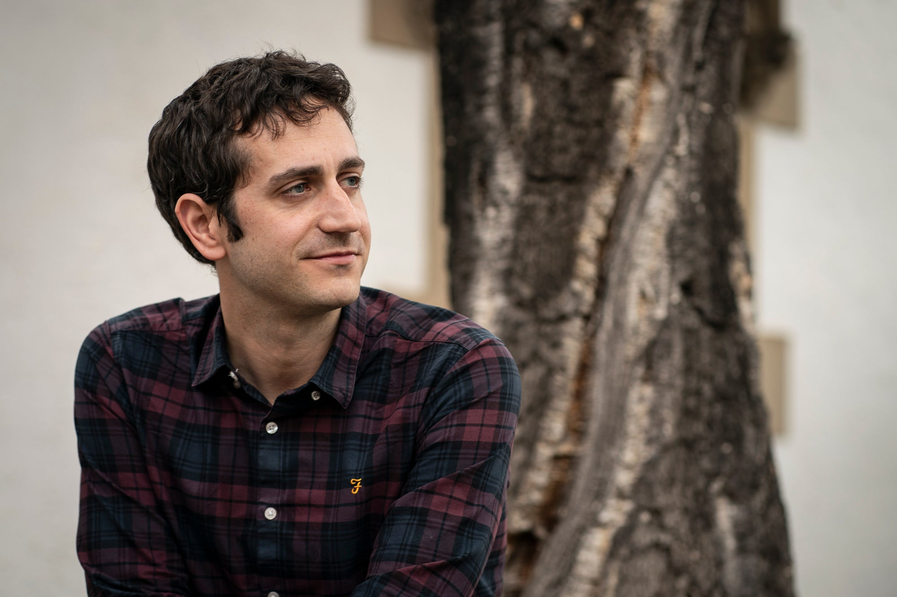
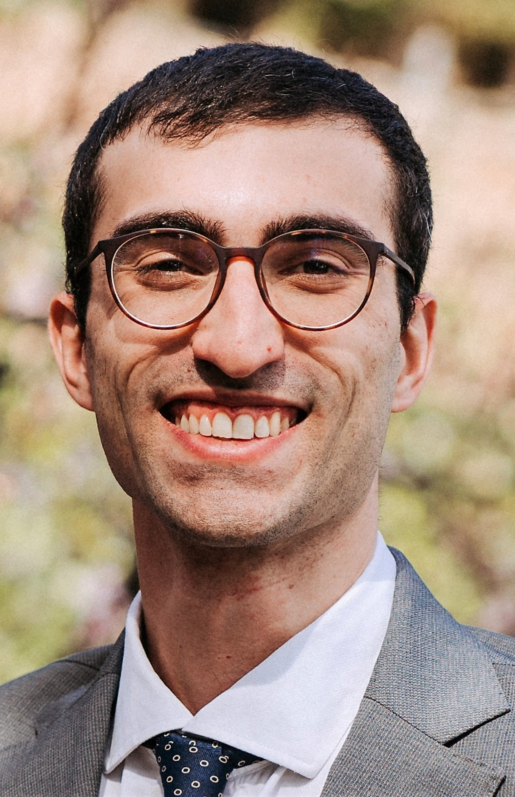

```{=html}
<div class="masthead">
  <span>Atlas Electoral · Segunda República Española · 1931–1936</span>
  <div class="lang-switcher">
    <a href="../en/about.html" class="lang-btn">EN</a>
    <a href="../es/about.html" class="lang-btn active">ES</a>
    <a href="../ca/about.html" class="lang-btn">CA</a>
  </div>
</div>

<div class="page-header">
  <div class="page-header-flag"></div>
  <div class="page-header-label">El equipo</div>
  <h1 class="page-header-title">Sobre el Proyecto</h1>
  <p class="page-header-sub">Quiénes somos y qué tratamos de entender</p>
</div>

<section class="content-section">
  <div class="section-label">La investigación</div>
  <h2 class="section-title">¿Por qué cartografiar las elecciones de la Segunda República?</h2>
  <p class="section-body">La Segunda República Española (1931–1939) celebró tres elecciones parlamentarias bajo sufragio universal — incluyendo las primeras elecciones en España en las que las mujeres pudieron votar (1933). Estas elecciones tuvieron lugar en un contexto de alta polarización y sus resultados han sido objeto de intenso debate histórico y político desde entonces.</p>
  <p class="section-body">Sin embargo, los datos completos y sistemáticos a nivel municipal para las tres elecciones nunca habían sido recopilados en un único conjunto de datos coherente y de acceso abierto. Este proyecto llena ese vacío.</p>

  <div class="pull-quote">
    <p>«La geografía de las elecciones de la República codifica la geografía de la Guerra Civil que siguió. Para entender una, hay que entender la otra.»</p>
    <cite>Descripción del proyecto, 2024</cite>
  </div>

  <div class="section-label mt-lg">El equipo</div>
  <h3 class="section-title" style="font-size:1.3rem;">Quiénes somos</h3>
  <div class="team-grid">

    <div class="team-card">
      <div class="team-avatar"></div>
      <div class="team-name">Toni Rodon</div>
      <div class="team-role">IP · VEARLYDEM — Voting in Early Democracies: The Case of the Spanish Second Republic</div>
      <p class="team-bio">
        Profesor asociado de Ciencia Política en la Universitat Pompeu Fabra (Barcelona),
        investigador ICREA Academia y delegado de transferencia de conocimiento en Ciencias
        Sociales y Humanidades en la UPF. Su investigación se centra en comportamiento político,
        política comparada y economía política histórica.
      </p>
      <div class="team-links">
        <a href="https://www.tonirodon.cat" class="team-link" target="_blank" rel="noopener">🌐 Web</a>
        <a href="https://www.linkedin.com/in/toni-rodon-6a7299375/" class="team-link" target="_blank" rel="noopener">💼 LinkedIn</a>
        <a href="https://bsky.app/profile/tonirodon.bsky.social" class="team-link" target="_blank" rel="noopener">🦋 Bluesky</a>
      </div>
    </div>

    <div class="team-card">
      <div class="team-avatar"></div>
      <div class="team-name">Pau-Vall Prat</div>
      <div class="team-role">Investigador</div>
      <p class="team-bio">
        Profesor lector en la Universitat de Barcelona y Teaching Fellow en la Universitat
        Oberta de Catalunya. Su investigación estudia la democratización, la competencia
        entre élites y la economía política histórica en Europa.
      </p>
      <div class="team-links">
        <a href="https://sites.google.com/site/pauvallprat/" class="team-link" target="_blank" rel="noopener">🌐 Web</a>
        <a href="https://www.linkedin.com/in/pau-vall-i-prat-82550848/" class="team-link" target="_blank" rel="noopener">💼 LinkedIn</a>
        <a href="https://bsky.app/profile/pauvallprat.bsky.social" class="team-link" target="_blank" rel="noopener">🦋 Bluesky</a>
      </div>
    </div>

    <div class="team-card">
      <div class="team-avatar"></div>
      <div class="team-name">Diego Martin-Alvarez</div>
      <div class="team-role">Asistente de investigación</div>
      <p class="team-bio">
        Politólogo y graduado del máster del Instituto Carlos III-Juan March.
        Desde octubre de 2025 trabaja como asistente de investigación en VEARLYDEM
        en la Universitat Pompeu Fabra. Sus intereses incluyen economía política histórica,
        reformas educativas y geografía política.
      </p>
      <div class="team-links">
        <a href="https://dmartinalv.github.io/" class="team-link" target="_blank" rel="noopener">🌐 Web</a>
        <a href="https://es.linkedin.com/in/diego-mart%C3%ADn-%C3%A1lvarez-293a27254" class="team-link" target="_blank" rel="noopener">💼 LinkedIn</a>
        <a href="https://bsky.app/profile/diegomartin-916.bsky.social" class="team-link" target="_blank" rel="noopener">🦋 Bluesky</a>
      </div>
    </div>

  </div>

  <div class="section-label mt-lg">Financiación y agradecimientos</div>
  <div class="info-grid">
    <div class="info-item"><div class="info-item-label">Financiado por</div><div class="info-item-value">Ministerio de Ciencia, Innovación y Universidades</div></div>
    <div class="info-item"><div class="info-item-label">Proyecto</div><div class="info-item-value">VEARLYDEM</div></div>
    <div class="info-item"><div class="info-item-label">Institución anfitriona</div><div class="info-item-value">Universitat Pompeu Fabra</div></div>
    <div class="info-item"><div class="info-item-label">Período</div><div class="info-item-value">2023–2026</div></div>
  </div>
</section>

<footer class="site-footer">
  <p>Atlas Electoral de la Segunda República Española &nbsp;·&nbsp; Universitat Pompeu Fabra &nbsp;·&nbsp; 2025</p>
</footer>
```
